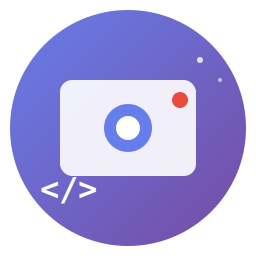
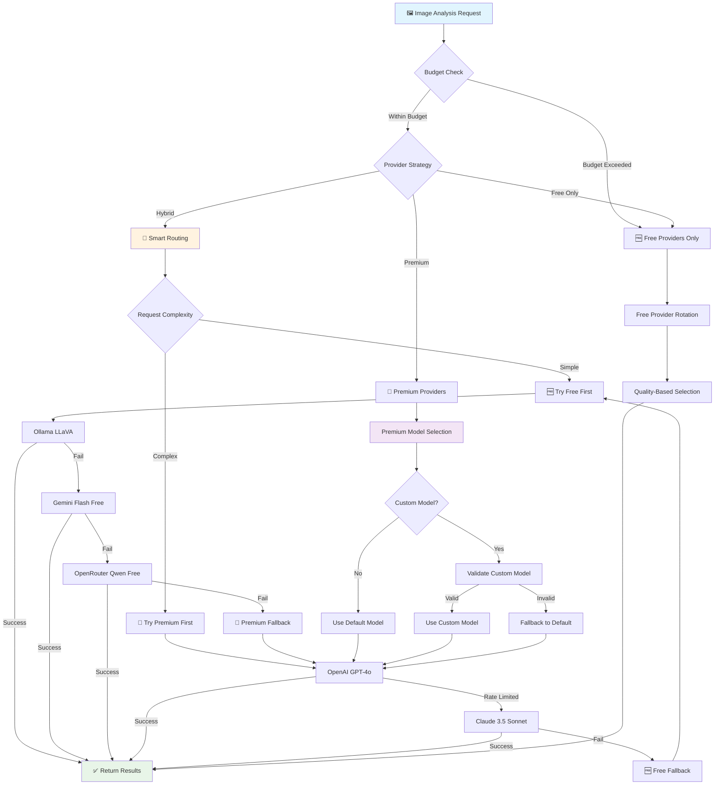
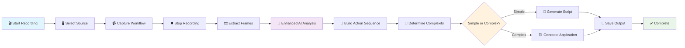
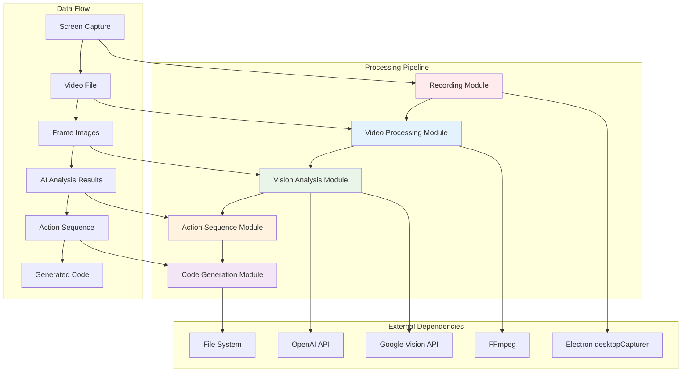

# Automated Development Recorder

<div align="center">



**Transform screen recordings into executable code using AI vision analysis**

[](https://opensource.org/licenses/MIT)
[](https://nodejs.org/)
[](https://electronjs.org/)
[](https://www.typescriptlang.org/)
[](https://reactjs.org/)

</div>

## 🎯 Project Overview

The **Automated Development Recorder** is a powerful Windows 11 desktop application that revolutionizes workflow automation by transforming screen recordings into executable code. Using advanced AI vision models, it analyzes user interactions and automatically generates clean, documented Python automation scripts or full application scaffolds.

### 🚀 Key Features

- **🎥 Intelligent Screen Recording**: Capture desktop interactions with configurable quality and source selection
- **🤖 Dynamic AI Model Support**: Use custom models from 20+ providers including OpenAI, Anthropic, Google, and OpenRouter
- **🆓 Comprehensive Free Tier**: 21,000+ free requests monthly with intelligent provider rotation
- **⚡ Smart Code Generation**: Automatically generate Python scripts or full applications based on workflow complexity
- **🔒 Secure API Management**: Local storage with encryption for API keys using Electron's safe storage
- **🎯 Intelligent Provider Routing**: Automatic fallback and cost optimization across multiple AI providers
- **🛡️ Privacy-First Design**: Local Ollama support for unlimited private analysis
- **📊 Real-time Progress Tracking**: Visual feedback during recording and processing phases
- **🚀 Interactive Setup System**: Menu-driven configuration with budget management and performance tuning
- **🔧 Model Validation**: Real-time model availability checking and intelligent fallback selection

### 🎯 Use Cases

- **UI Test Automation**: Generate automated testing scripts from manual test workflows
- **Data Entry Automation**: Create scripts for repetitive form filling and data input tasks
- **Application Prototyping**: Scaffold new applications based on demonstrated UI flows
- **Workflow Documentation**: Generate executable documentation of complex processes
- **Training Material Creation**: Create step-by-step automation guides with working code

## 🏗️ Architecture Overview

### Enhanced System Architecture (2025 Edition)

```mermaid
graph TB
    subgraph "Electron Application"
        subgraph "Main Process"
            A["Main Process Controller"]
            B["IPC Handlers"]
            C["Enhanced Settings Manager"]
            D["Error Handler"]
        end

        subgraph "Renderer Process"
            E["React UI"]
            F["Recording Panel"]
            G["Processing Panel"]
            H["Enhanced Config Panel"]
            I["Model Configuration Panel"]
            J["Code Display"]
        end

        subgraph "Core Modules"
            K["Recording Module"]
            L["Video Processing Module"]
            M["Enhanced Vision Analysis Module"]
            N["Model Management Service"]
            O["Provider Routing Engine"]
            P["Action Sequence Module"]
            Q["Code Generation Module"]
        end
    end

    subgraph "AI Provider Ecosystem (20+ Providers)"
        subgraph "Free Tier (Unlimited)"
            R["Ollama LLaVA (Local)"]
            S["Google Gemini 2.5 Flash"]
            T["OpenRouter Qwen2.5-VL"]
            U["Groq LLaVA"]
        end

        subgraph "Free Credits"
            V["Together AI ($5/month)"]
            W["DeepInfra ($5/month)"]
            X["Fireworks AI ($1/month)"]
        end

        subgraph "Premium Providers"
            Y["OpenAI GPT-4o"]
            Z["Anthropic Claude 3.5"]
            AA["Google Gemini Pro"]
            BB["Azure Document Intelligence"]
        end
    end

    subgraph "System Resources"
        CC["Desktop Capturer"]
        DD["FFmpeg"]
        EE["File System"]
        FF["Model Validation APIs"]
    end

    A --> B
    B --> E
    E --> F
    E --> G
    E --> H
    E --> I
    E --> J

    A --> K
    A --> L
    A --> M
    A --> N
    A --> O
    A --> P
    A --> Q

    M --> N
    M --> O
    N --> FF
    O --> R
    O --> S
    O --> T
    O --> U
    O --> V
    O --> W
    O --> X
    O --> Y
    O --> Z
    O --> AA
    O --> BB

    K --> CC
    L --> DD
    Q --> EE
    C --> EE
    D --> EE
```



### Intelligent Provider Routing System



### User Workflow Pipeline



### Core Module Interactions



## 🛠️ Technical Requirements

### System Requirements

- **Operating System**: Windows 11 (required for optimal screen capture)
- **Node.js**: Version 18.0.0 or higher
- **Memory**: Minimum 8GB RAM (16GB recommended for large video processing)
- **Storage**: At least 2GB free space for application and temporary files
- **Network**: Internet connection for AI API calls

### Dependencies

#### Core Dependencies
- **Electron 28.x**: Desktop application framework
- **React 18.x**: User interface library
- **TypeScript 5.x**: Type-safe JavaScript development
- **FFmpeg**: Video processing and frame extraction
- **Jimp**: Image processing and similarity detection
- **Axios**: HTTP client for API requests

#### Development Dependencies
- **Webpack 5.x**: Module bundler and build system
- **Jest**: Testing framework
- **ESLint**: Code linting and quality assurance
- **Prettier**: Code formatting
- **Electron Builder**: Application packaging and distribution

### AI Provider Ecosystem (2025 Edition)

#### 🆓 Completely Free Providers (No API Key Required)
- **Ollama LLaVA**: Local unlimited analysis with complete privacy
- **Google Gemini 2.5 Flash**: 500 requests/day, state-of-the-art quality
- **OpenRouter Qwen2.5-VL**: 100 requests/day, advanced reasoning
- **Groq LLaVA**: 100 requests/day, ultra-fast inference (<1s)
- **Hugging Face Inference**: Rate-limited but always available

#### 💰 Free Credits Providers (Monthly Allowance)
- **Together AI**: $5 free credits monthly (~200 requests)
- **DeepInfra**: $5 free credits monthly (~500 requests)
- **Fireworks AI**: $1 free credits monthly (~50 requests)

#### 💎 Premium Providers (Optional for Highest Quality)
- **OpenAI GPT-4o**: Industry-leading vision analysis
- **Anthropic Claude 3.5 Sonnet**: Exceptional reasoning and large context
- **Google Gemini 2.5 Pro**: Fast processing with excellent quality
- **Azure Document Intelligence**: Specialized document and OCR analysis

#### 🔧 Custom Model Support
- **OpenRouter**: 50+ vision models with custom model names
- **OpenAI**: All GPT-4 vision variants with model selection
- **Real-time Validation**: Automatic model availability checking
- **Intelligent Fallbacks**: Quality-based alternative model selection

#### 📊 Total Free Capacity (2025)
- **21,000+ requests/month** across all free providers
- **Unlimited local analysis** with Ollama LLaVA
- **3x improvement** over 2024 free tier options
- **Estimated savings**: $500-1000+ monthly vs single premium provider

## 📦 Installation and Setup

### 🚀 Interactive Setup (2025 Edition)

**Get started in minutes with our comprehensive interactive setup system:**

```bash
# Clone the repository
git clone https://github.com/usemanusai/pic2tool.git
cd pic2tool

# Run the interactive setup - comprehensive configuration!
npm run setup
```

**🎯 Setup Modes:**
- **Quick Setup**: 3-minute wizard with smart defaults (recommended for beginners)
- **Advanced Setup**: Full configuration control for power users
- **Guided Tour**: Learn about all options with detailed explanations

**🔧 The interactive setup will:**
- ✅ **Environment Validation**: Node.js 18+, Windows 11, FFmpeg, system requirements
- ✅ **Provider Tier Selection**: Free-only, hybrid, or premium strategies with cost estimates
- ✅ **Budget Management**: Monthly/daily spending limits and per-request cost controls
- ✅ **Performance Tuning**: Speed vs quality, cost vs accuracy, privacy level preferences
- ✅ **Geographic Routing**: Regional provider preferences for optimal performance
- ✅ **Use Case Optimization**: Presets for document OCR, UI analysis, cost optimization, batch processing
- ✅ **Model Configuration**: Custom model support with real-time validation
- ✅ **Provider Testing**: Connectivity verification and intelligent fallback setup
- ✅ **Cost Savings Analysis**: Detailed breakdown of potential monthly savings

**💰 2025 Cost Revolution:**
- **$0/month**: Unlimited local analysis with Ollama + 21,000+ free cloud requests
- **$5-25/month**: Hybrid strategy saves 80-95% vs single provider
- **Smart Rotation**: Automatic provider switching and intelligent fallback

**That's it!** The setup script handles everything automatically with intelligent defaults.

### ⚡ Quick Environment Check

Want to quickly check if your system is ready?

```bash
npm run validate
```

This runs a fast validation of your environment without full setup.

### 📚 Setup Documentation

- **[QUICK_START.md](QUICK_START.md)** - One-command setup guide
- **[SETUP.md](SETUP.md)** - Detailed setup and troubleshooting

### 🔧 Manual Setup (Alternative)

If you prefer manual setup or the automated setup fails:

#### Prerequisites Installation

1. **Install Node.js 18+**
   ```bash
   # Download from https://nodejs.org/
   # Verify installation
   node --version
   npm --version
   ```

2. **Install FFmpeg**
   ```bash
   # Option 1: Download from https://ffmpeg.org/download.html
   # Add to system PATH

   # Option 2: Using package manager (if available)
   # winget install FFmpeg

   # Verify installation
   ffmpeg -version
   ```

#### Application Installation

1. **Clone the Repository**
   ```bash
   git clone https://github.com/usemanusai/pic2tool.git
   cd pic2tool
   ```

2. **Install Dependencies**
   ```bash
   npm install
   ```

3. **Verify Installation**
   ```bash
   # Run build to ensure everything is working
   npm run build
   ```

#### Provider Configuration (Enhanced 2025 System)

1. **Launch the Application**
   ```bash
   npm run dev
   ```

2. **Access Enhanced Configuration**
   - Navigate to the **⚙️ Config** tab
   - Choose from multiple configuration panels:
     - **🔑 API Keys**: Manage multiple provider keys with rotation
     - **🆓 Free Providers**: Check availability and setup local providers
     - **🤖 Model Configuration**: Add custom models and validate availability
     - **📊 Usage Analytics**: Monitor costs and provider performance
     - **🎯 Routing Preferences**: Configure intelligent provider selection

3. **Configure Custom Models** (Optional)
   - Select a provider that supports custom models (OpenRouter, OpenAI)
   - Click **Add Custom Model**
   - Enter model name (e.g., "anthropic/claude-3.5-sonnet")
   - System validates model availability in real-time
   - Configure as default or fallback option

4. **Test Configuration**
   - Use the built-in **Provider Test** feature
   - Record a short test workflow
   - Monitor which providers are used in the **Analytics** panel
   - Verify cost tracking and budget controls

## 🚀 Usage Guide

### Getting Started

#### 1. Recording Your First Workflow

1. **Open the Application**
   ```bash
   npm start
   ```

2. **Navigate to Recording Tab**
   - Click the **📹 Record** tab
   - Select your screen or specific window from the dropdown
   - Choose recording quality (Low/Medium/High)

3. **Start Recording**
   - Click **🔴 Start Recording**
   - Wait for the 3-second countdown
   - Perform your workflow slowly and deliberately
   - Click **⏹️ Stop Recording** when finished

#### 2. Processing the Recording

1. **Navigate to Processing Tab**
   - Click the **⚙️ Process** tab
   - Select your recorded video file
   - Choose or create a project folder

2. **Start Processing**
   - Click **🚀 Process Video**
   - Monitor progress in the status bar
   - Wait for AI analysis to complete

#### 3. Reviewing Generated Code

1. **View Results**
   - Generated code appears in the right panel
   - Browse through different files using tabs
   - Review the setup instructions

2. **Export Code**
   - Click **📋** to copy individual files
   - Click **📄** to copy all files
   - Click **📁** to export to a folder
   - Click **🔍** to open project folder

### Advanced Usage

#### Recording Best Practices

- **Slow and Deliberate Actions**: Perform actions slowly for better AI recognition
- **Clear UI Elements**: Ensure buttons and text are clearly visible
- **Consistent Timing**: Wait briefly between actions
- **Avoid Rapid Mouse Movements**: Keep cursor movements smooth

#### Processing Optimization

- **Frame Rate Settings**: Lower frame rates (1-2 fps) for simple workflows
- **Similarity Threshold**: Higher values (0.95+) to skip redundant frames
- **Max Frames Limit**: Set appropriate limits based on workflow complexity

#### API Key Management

- **Multiple Keys**: Add multiple API keys for rate limit rotation
- **Key Rotation**: Application automatically rotates keys during large jobs
- **Security**: Keys are encrypted and stored locally

## 🔧 Development

### Development Setup

**Recommended: Use the automated setup**
```bash
# Complete development environment setup
npm run setup
```

**Manual development setup:**
```bash
# Install dependencies
npm install

# Validate environment
npm run validate

# Start development server
npm run dev

# Run tests
npm test

# Lint code
npm run lint

# Format code
npm run format
```

### Building and Distribution

```bash
# Development build
npm run build:dev

# Production build
npm run build

# Create distribution package
npm run dist

# Clean build artifacts
npm run clean
```

### Project Structure

```
src/
├── main/                 # Electron main process
│   └── main.ts          # Application entry point
├── preload/             # Preload scripts
│   └── preload.ts       # IPC bridge
├── renderer/            # React UI
│   ├── App.tsx          # Main app component
│   ├── components/      # UI components
│   └── index.tsx        # Renderer entry point
├── modules/             # Core business logic
│   ├── RecordingModule.ts
│   ├── VideoProcessingModule.ts
│   ├── VisionAnalysisModule.ts
│   ├── ActionSequenceModule.ts
│   └── CodeGenerationModule.ts
├── shared/              # Shared utilities
│   ├── ErrorHandler.ts
│   └── SettingsManager.ts
└── test/               # Test files

assets/                 # Application assets
scripts/               # Build scripts
dist/                  # Built application
release/               # Distribution packages
```

## 🔍 Troubleshooting

### 🚀 Automated Troubleshooting

**First, try the automated setup system:**
```bash
# The setup script provides detailed troubleshooting
npm run setup
```

**For quick environment diagnosis:**
```bash
# Fast validation with specific guidance
npm run validate
```

The setup system automatically:
- ✅ Diagnoses common issues
- ✅ Provides specific solutions
- ✅ Tests your configuration
- ✅ Offers step-by-step fixes

### 📚 Detailed Troubleshooting

For comprehensive troubleshooting guidance, see:
- **[SETUP.md](SETUP.md)** - Complete troubleshooting guide
- **[QUICK_START.md](QUICK_START.md)** - Common issues and solutions

### Common Issues

#### FFmpeg Not Found
```bash
# Use automated detection
npm run validate  # Shows FFmpeg status

# Manual verification
ffmpeg -version

# Add to PATH or place executable in project root
# Windows: Add FFmpeg bin directory to system PATH
```

#### Recording Permissions
- **Windows**: Check screen recording permissions in Privacy settings
- **Source Selection**: Try different screen/window sources
- **Administrator**: Run as administrator if permission issues persist

#### API Errors
```bash
# The setup script tests API keys automatically
npm run setup

# Manual checks
# Check API key validity
# Verify API quotas and rate limits
# Monitor network connectivity
# Review API service status
```

#### Build Errors
```bash
# Let the setup script diagnose and fix
npm run setup

# Manual troubleshooting
# Clear dependencies and reinstall
rm -rf node_modules package-lock.json
npm install

# Check Node.js version
node --version  # Should be 18+

# Verify all dependencies
npm audit
```

### Debug Mode

Enable verbose logging:
```bash
DEBUG=* npm run dev
```

### Log Files

Application logs are stored in:
- **Windows**: `%APPDATA%/automated-development-recorder/logs/`
- **Log Levels**: error, warn, info, debug
- **Rotation**: Automatic log file rotation

## 🤝 Contributing

We welcome contributions! Please see our [Contributing Guide](CONTRIBUTING.md) for details.

### Development Workflow

1. **Fork the Repository**
2. **Create Feature Branch**
   ```bash
   git checkout -b feature/your-feature-name
   ```
3. **Make Changes**
4. **Add Tests**
5. **Submit Pull Request**

### Code Style

- Use TypeScript for all new code
- Follow existing naming conventions
- Add JSDoc comments for public APIs
- Ensure all tests pass before submitting

## 📄 License

This project is licensed under the MIT License - see the [LICENSE](LICENSE) file for details.

## 🆘 Support

### Getting Help

1. **Automated Diagnosis**: Run `npm run setup` or `npm run validate` for automatic troubleshooting
2. **Documentation**: Check [SETUP.md](SETUP.md), [QUICK_START.md](QUICK_START.md), and [DEVELOPMENT.md](DEVELOPMENT.md)
3. **Setup Logs**: Review `setup-log.txt` and `setup-report.json` for detailed diagnostic information
4. **Issues**: Search existing [GitHub Issues](https://github.com/usemanusai/pic2tool/issues)
5. **New Issue**: Create a detailed issue report with setup logs and steps to reproduce

### Community

- **Discussions**: Join our [GitHub Discussions](https://github.com/usemanusai/pic2tool/discussions)
- **Updates**: Watch the repository for updates and releases

### Quick Diagnostic Commands

```bash
# Quick environment check
npm run validate

# Full setup with troubleshooting
npm run setup

# Check setup logs
cat setup-log.txt
```

---

<div align="center">

**Made with ❤️ for developers who love automation**

[⭐ Star this project](https://github.com/your-username/automated-development-recorder) if you find it useful!

</div>
