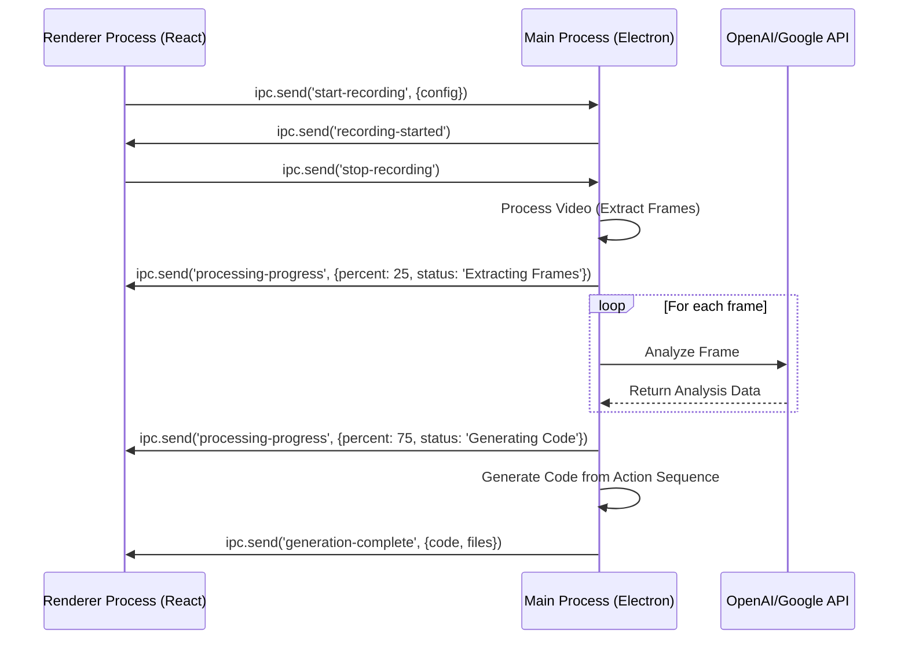

# Automated Development Recorder - Technical Architecture Document

## Document Information
- **Version**: 1.0
- **Date**: 2024-06-20
- **Status**: Final
- **Prepared for**: Development Handoff

## Executive Summary

### Architecture Overview
This document specifies the technical architecture for the Automated Development Recorder, a Windows 11 desktop application built with Electron. The system is designed as a modular pipeline that processes video recordings of user workflows through stages of frame extraction, AI-driven analysis, and final code generation. The architecture prioritizes local processing, privacy, and efficiency, leveraging user-provided API keys for external AI vision services. The core design ensures that different components (UI, video processing, AI analysis, code generation) are decoupled for maintainability and future extension.

### Key Design Principles
- **Modularity**: Each core function (recording, analysis, generation) is a distinct module to allow for independent development and chunk-based processing.
- **Privacy First**: No user data or recordings are transmitted to any third party, except for the analysis data sent to the user's chosen AI vision service via their own API keys.
- **Extensibility**: The interface for AI vision services is generic, allowing for the future addition of different AI providers.
- **Efficiency**: The architecture includes mechanisms to manage memory and processing load, such as skipping similar frames and processing videos in chunks.

## System Overview

### High-Level Architecture
The application follows a pipeline processing model. A user records a workflow, and the video is passed through a series of modules that transform it from raw pixels into executable code. The application is built using the Electron framework, which allows for a rich user interface built with web technologies while maintaining deep integration with the host operating system for tasks like screen recording.

```mermaid
graph TD
    subgraph User Interaction
        A[React UI]
    end
    subgraph Electron Main Process (Backend Logic)
        B[Screen Recording Module]
        C[Video Processing Module - FFmpeg]
        D[Vision Analysis Module]
        E[Action Sequence Module]
        F[Code Generation Module]
    end
    subgraph External Services
        G[OpenAI/Google Vision API]
    end

    A -- Record Command --> B
    B -- Video File --> C
    C -- Video Frames --> D
    D -- API Keys & Frames --> G
    G -- Structured Data --> D
    D -- Analysis Data --> E
    E -- Action Sequence --> F
    F -- Generated Code --> A
```

## Technology Stack

### Core Technologies
| Component | Technology | Version | Justification |
|---|---|---|---|
| **Desktop Framework** | Electron | 28.x | Enables cross-platform desktop apps with web technologies (HTML/JS/CSS). Excellent for building rich UIs and accessing native OS features. |
| **Language** | TypeScript | 5.x | Provides static typing for JavaScript, improving code quality, maintainability, and developer experience in a complex project. |
| **UI Framework** | React | 18.x | A popular and robust library for building user interfaces. Works seamlessly within Electron's renderer process. |
| **Video Processing** | FFmpeg | Latest | The industry-standard open-source tool for video manipulation. Will be used via a Node.js wrapper like `fluent-ffmpeg`. |
| **Settings/Key Storage** | electron-store / electron-safe-storage | Latest | Provides a simple and secure way to persist user settings and encrypt sensitive data like API keys on the local file system. |
| **Build/Packaging** | electron-builder | Latest | A complete solution to package and build a ready-for-distribution Electron app for Windows. |
| **Logging**| electron-log | Latest | A simple logging library designed for Electron applications, supporting file-based logs for debugging. |

## Component Architecture

### System Components
The application is logically divided into several modules, primarily managed by the Electron Main Process, with the UI handled by the Renderer Process.

-   **Electron Main Process**: The application's backend. It manages application windows, has access to the file system and OS-level features, and orchestrates the entire video-to-code pipeline.
-   **Electron Renderer Process**: The application's frontend, built using React. It is responsible for all user interactions, from initiating recordings to displaying the final generated code. It communicates with the Main Process via IPC.
-   **Recording Module**: Utilizes Electron's `desktopCapturer` API to access and record screen content.
-   **Video Processing Module**: Responsible for taking a raw video file and using FFmpeg to extract individual frames at a specified rate. It also contains the logic for comparing consecutive frames to discard duplicates.
-   **Vision Analysis Module**: This is the core AI component. It manages a pool of user-provided API keys and implements a rotation strategy. It sends frames to the selected external AI Vision API (e.g., GPT-4V) and receives structured data describing the contents of each frame.
-   **Action Sequence Module**: A rule-based engine that consumes the structured data from the Vision Analysis Module. It reconstructs the user's workflow, identifying logical actions like "click button 'Submit'" or "type 'hello world' into field 'Username'".
-   **Code Generation Module**: The final stage of the pipeline. It takes the logical action sequence and uses templates to generate code. It contains two sub-modules:
    -   **Script Generator**: For simple workflows, it generates Python scripts using `pyautogui`.
    -   **Application Generator**: For complex workflows, it generates a boilerplate project structure for a desktop or web application.

### Component Interactions
Communication between the UI (Renderer) and the backend (Main) is asynchronous via Electron's IPC channels.



## Data Architecture

### Data Flow
The primary data flow is linear: Video -> Frames -> JSON Analysis -> Action Sequence -> Code Files. All intermediate data is stored locally within a dedicated project folder to allow the user to pause, resume, and debug the process.

### Data Storage Strategy
-   **Project Storage**: Each recording session will create a new project folder in a user-configurable location (e.g., `Documents\AutomatedDevelopmentRecorder\MyNewProject\`). This folder will contain the source video, a `frames` subdirectory, an `analysis.json` file, and an `output` subdirectory for the generated code.
-   **Application Settings**: User settings and API keys will be stored in the standard Electron application data path (`%APPDATA%`). API keys will be encrypted using `electron-safe-storage`.

## API Design

### Internal APIs (IPC)
Inter-process communication (IPC) will be used for the UI to command the main process and for the main process to send progress updates back to the UI. Key channels include:
-   `start-recording`, `stop-recording`
-   `process-video`
-   `processing-progress`
-   `generation-complete`

### External APIs
The application will interact with the REST APIs of OpenAI (GPT-4V) and/or Google Vision. It will implement a generic `VisionService` interface with methods like `analyzeFrame(frame: Buffer): Promise<AnalysisResult>`. Concrete classes like `OpenAIVisionService` and `GoogleVisionService` will implement this interface.

## Security Architecture

-   **API Key Management**: API keys are the primary sensitive data. They will be stored on the local machine using `electron-safe-storage` to leverage OS-level encryption.
-   **Network Communication**: All network traffic is initiated by the application to trusted AI service endpoints (provided by the user) and must use HTTPS. The application will not open any inbound ports.
-   **Code Execution**: The application generates code but does not execute it. The user is responsible for running the generated scripts or applications in a safe environment.

## Infrastructure and Deployment

-   **Deployment Strategy**: The application will be packaged for Windows using `electron-builder`. This will create a standard `.exe` installer.
-   **CI/CD**: For this personal project, a complex CI/CD pipeline is not required. However, a simple GitHub Actions workflow can be configured to automatically build the installer file when a new version tag is pushed to the repository.
-   **Monitoring and Logging**: Logging will be directed to a local file (`debug.log`) using `electron-log`. This allows the user to inspect logs for debugging purposes without any data leaving their machine.

## Development Guidelines

### Coding Standards
-   **Language**: TypeScript with strict mode enabled.
-   **Style Guide**: ESLint with a standard configuration (e.g., `eslint-config-airbnb-typescript`).
-   **Formatter**: Prettier will be used for automatic code formatting.

### Testing Strategy
-   **Unit Testing**: Core logic modules (Action Sequence, Code Generation, API key rotation) will be unit-tested using Jest.
-   **Integration Testing**: The interaction between modules will be tested. For example, testing the full pipeline with a short sample video and a mock AI Vision API.
-   **End-to-End Testing**: The final application can be tested using an E2E framework for Electron like Playwright or Spectron to simulate user interaction with the application's UI.