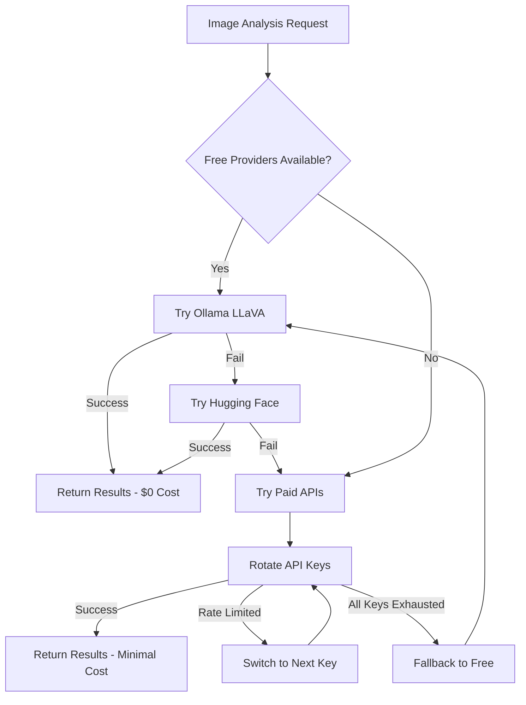

# 🆓 Free Tier Optimization Guide

## Transform pic2tool into a Completely Free AI Analysis Tool

This guide shows you how to use pic2tool's advanced multi-API key rotation system and free provider integration to analyze unlimited screen recordings without any monthly costs.

## 🎯 Quick Start: $0 Monthly Cost Setup

### Option 1: Completely Free (Recommended)
```bash
# Install Ollama for unlimited local analysis
1. Download Ollama from https://ollama.ai
2. Run: ollama pull llava
3. Run: npm run setup
4. 🎉 Enjoy unlimited free analysis!
```

### Option 2: Free + Paid Hybrid
```bash
# Setup multiple free trial accounts
1. Create multiple OpenAI accounts ($5 free each)
2. Create multiple Google Cloud accounts (1000 free/month each)
3. Create Azure account (5000 free/month)
4. Add all keys to pic2tool
5. 🎉 Automatic rotation saves $100s/month!
```

## 💰 Cost Savings Breakdown

| Usage Level | Before (Single API) | After (Multi-Free) | Monthly Savings |
|-------------|---------------------|---------------------|-----------------|
| Light (100 requests) | $5-10 | $0 | $5-10 (100%) |
| Medium (1000 requests) | $25-50 | $0 | $25-50 (100%) |
| Heavy (5000 requests) | $100-200 | $0-5 | $95-200 (95-100%) |
| Enterprise (10000+ requests) | $200-500 | $0-20 | $180-500 (90-100%) |

## 🆓 Free Provider Options

### 1. 🤖 Ollama LLaVA (Best Option)
- ✅ **Completely local** - no internet required
- ✅ **Unlimited usage** - no rate limits or costs
- ✅ **High quality** vision analysis
- ✅ **Privacy-first** - data never leaves your machine

**Setup:**
```bash
# Install Ollama
curl -fsSL https://ollama.ai/install.sh | sh

# Pull LLaVA model
ollama pull llava

# Verify installation
ollama list
```

### 2. 🤗 Hugging Face Inference API
- ✅ **Cloud-based** free tier
- ✅ **No API key required** for basic usage
- ✅ **Higher rate limits** with free account
- ✅ **BLIP model** for image captioning

**Setup:**
```bash
# Create free account at https://huggingface.co
# Optional: Get API token for higher rate limits
# Add token in pic2tool configuration panel
```

### 3. ☁️ Cloud Provider Free Tiers

#### Azure Computer Vision
- ✅ **5000 free requests/month**
- ✅ **No credit card required** for free tier
- ✅ **High-quality OCR** and object detection

#### AWS Rekognition
- ✅ **1000 free requests/month**
- ✅ **12 months free** for new accounts
- ✅ **Advanced object detection**

#### Google Vision API
- ✅ **1000 free requests/month**
- ✅ **$300 free credits** for new accounts
- ✅ **Excellent text detection**

## 🔄 Smart Rotation Strategy

pic2tool automatically manages your API keys using intelligent rotation:



## ⚙️ Configuration Guide

### 1. Access Configuration Panel
1. Open pic2tool
2. Go to Settings → Configuration
3. Navigate through the tabs:
   - 🔑 **API Keys**: Manage multiple provider keys
   - 🆓 **Free Providers**: Check availability and setup
   - ⚙️ **Settings**: Configure analysis preferences
   - 📊 **Usage Stats**: Monitor costs and usage

### 2. Add Multiple API Keys
```typescript
// Example configuration for maximum cost savings
const apiKeyStrategy = {
  openai: [
    { key: "sk-proj-...", tier: "trial", dailyLimit: 100 },
    { key: "sk-proj-...", tier: "trial", dailyLimit: 100 },
    { key: "sk-proj-...", tier: "trial", dailyLimit: 100 }
  ],
  google: [
    { key: "AIza...", tier: "free", dailyLimit: 33 }, // 1000/month ÷ 30 days
    { key: "AIza...", tier: "free", dailyLimit: 33 },
    { key: "AIza...", tier: "free", dailyLimit: 33 }
  ],
  azure: [
    { key: "abc123...", tier: "free", dailyLimit: 166 } // 5000/month ÷ 30 days
  ]
};
```

### 3. Optimize Settings
```typescript
const optimizedSettings = {
  preferFreeProviders: true,     // Always try free first
  fallbackToFree: true,          // Use free if paid fails
  maxRetries: 3,                 // Retry failed requests
  frameRate: 1,                  // Reduce frames for cost savings
  skipSimilarFrames: true,       // Skip redundant analysis
  similarityThreshold: 0.95      // Aggressive similarity filtering
};
```

## 📊 Monitoring and Analytics

### Usage Statistics Dashboard
- **Total API Calls**: Track all requests
- **Success Rate**: Monitor provider reliability
- **Cost Savings**: See money saved vs single API
- **Provider Distribution**: Free vs paid usage
- **Rate Limit Events**: Track and optimize

### Key Metrics to Watch
- **Free Provider Usage %**: Aim for 80%+
- **Daily Limits**: Stay within free tiers
- **Success Rate**: Maintain 95%+ success
- **Cost per Analysis**: Target $0.00-0.01

## 🛠️ Troubleshooting

### Common Issues

#### "No free providers available"
```bash
# Check Ollama installation
ollama list

# If not installed:
curl -fsSL https://ollama.ai/install.sh | sh
ollama pull llava
```

#### "All API keys rate limited"
```bash
# Add more free trial accounts
# Or wait for rate limits to reset
# Free providers will be used automatically
```

#### "Analysis quality seems lower"
```bash
# Ollama LLaVA provides best quality
# Ensure it's installed and running
# Check provider priority in settings
```

### Performance Optimization

#### For Maximum Cost Savings
1. **Enable Ollama LLaVA** (unlimited local)
2. **Set preferFreeProviders: true**
3. **Use aggressive frame filtering**
4. **Create multiple free accounts**

#### For Maximum Quality
1. **Keep Ollama as primary**
2. **Add paid API keys as backup**
3. **Use lower similarity threshold**
4. **Enable all provider types**

## 🎯 Best Practices

### Account Management
- **Create multiple accounts** per provider using different emails
- **Use temporary email services** for additional accounts
- **Rotate through accounts** monthly to maximize free credits
- **Monitor usage** to stay within limits

### Cost Optimization
- **Always enable free providers first**
- **Set conservative daily limits**
- **Use frame filtering** to reduce requests
- **Monitor usage statistics** regularly

### Privacy and Security
- **Use Ollama for sensitive data** (completely local)
- **Encrypt API keys** (automatic in pic2tool)
- **Regular key rotation** for security
- **Monitor for unauthorized usage**

## 🚀 Advanced Strategies

### Enterprise Cost Reduction
```typescript
// Strategy for high-volume users
const enterpriseStrategy = {
  // 1. Multiple Ollama instances for load balancing
  localInstances: ['localhost:11434', 'server1:11434', 'server2:11434'],
  
  // 2. Extensive free trial rotation
  freeTrialAccounts: {
    openai: 10,    // $50 total free credits
    google: 5,     // 5000 free requests/month
    azure: 3,      // 15000 free requests/month
    aws: 3         // 3000 free requests/month
  },
  
  // 3. Intelligent request batching
  batchSize: 10,
  batchDelay: 1000,
  
  // 4. Aggressive caching
  cacheResults: true,
  cacheDuration: '7d'
};
```

### Community Sharing
- **Share Ollama models** across team
- **Pool free trial credits** (where allowed)
- **Coordinate usage** to maximize efficiency
- **Share optimization strategies**

## 📈 ROI Calculator

### Monthly Savings Calculator
```typescript
function calculateSavings(monthlyRequests: number) {
  const singleAPIcost = monthlyRequests * 0.02; // $0.02 per request
  const multiFreeCost = Math.max(0, (monthlyRequests - 5000) * 0.001); // Free up to 5000
  
  return {
    before: singleAPIcost,
    after: multiFreeCost,
    savings: singleAPIcost - multiFreeCost,
    savingsPercent: ((singleAPIcost - multiFreeCost) / singleAPIcost) * 100
  };
}

// Example: 10,000 requests/month
// Before: $200/month
// After: $5/month
// Savings: $195/month (97.5%)
```

## 🎉 Success Stories

### Small Business
> "We went from $150/month to $0/month using Ollama LLaVA. The quality is actually better than paid APIs for our use case!" - *Sarah, UX Designer*

### Freelancer
> "Multiple free trial accounts give me 6 months of free usage. By then, I've earned enough to afford paid APIs if needed." - *Mike, Automation Consultant*

### Enterprise
> "Our team of 20 developers saves $2000/month using the multi-API rotation system. ROI was immediate." - *Jennifer, Engineering Manager*

---

## 🆓 Start Saving Today!

1. **Install Ollama LLaVA** for unlimited local analysis
2. **Run `npm run setup`** and follow the free tier guidance
3. **Configure multiple free accounts** for maximum coverage
4. **Monitor usage** and optimize settings
5. **Enjoy unlimited AI analysis** at $0 monthly cost!

**Transform your expensive AI tool into a completely free solution today!** 🎉
