# Automated Development Recorder

<div align="center">


**Transform screen recordings into executable code using AI vision analysis**

[](https://opensource.org/licenses/MIT)
[](https://nodejs.org/)
[](https://electronjs.org/)
[](https://www.typescriptlang.org/)
[](https://reactjs.org/)

</div>

## 🎯 Project Overview

The **Automated Development Recorder** is a powerful Windows 11 desktop application that revolutionizes workflow automation by transforming screen recordings into executable code. Using advanced AI vision models, it analyzes user interactions and automatically generates clean, documented Python automation scripts or full application scaffolds.

### 🚀 Key Features

- **🎥 Intelligent Screen Recording**: Capture desktop interactions with configurable quality and source selection
- **🤖 AI-Powered Analysis**: Leverage OpenAI GPT-4V or Google Vision API for sophisticated frame analysis
- **⚡ Smart Code Generation**: Automatically generate Python scripts or full applications based on workflow complexity
- **🔒 Secure API Management**: Local storage with encryption for API keys using Electron's safe storage
- **🎯 Intelligent Output Selection**: Automatically determines whether to create simple scripts or complex applications
- **🛡️ Privacy-First Design**: All processing done locally, no data transmitted to third parties
- **📊 Real-time Progress Tracking**: Visual feedback during recording and processing phases

### 🎯 Use Cases

- **UI Test Automation**: Generate automated testing scripts from manual test workflows
- **Data Entry Automation**: Create scripts for repetitive form filling and data input tasks
- **Application Prototyping**: Scaffold new applications based on demonstrated UI flows
- **Workflow Documentation**: Generate executable documentation of complex processes
- **Training Material Creation**: Create step-by-step automation guides with working code

## 🏗️ Architecture Overview

### System Architecture


### User Workflow Pipeline

```mermaid
flowchart LR
    A["🎬 Start Recording"] --> B["🖥️ Select Source"]
    B --> C["📹 Capture Workflow"]
    C --> D["⏹️ Stop Recording"]
    D --> E["🎞️ Extract Frames"]
    E --> F["🤖 AI Analysis"]
    F --> G["🔄 Build Action Sequence"]
    G --> H["🧠 Determine Complexity"]
    H --> I{"Simple or Complex?"}
    I -->|Simple| J["📝 Generate Script"]
    I -->|Complex| K["🏗️ Generate Application"]
    J --> L["💾 Save Output"]
    K --> L
    L --> M["✅ Complete"]

    style A fill:#e1f5fe
    style M fill:#e8f5e8
    style I fill:#fff3e0
```



### Core Module Interactions


## 🛠️ Technical Requirements

### System Requirements

- **Operating System**: Windows 11 (required for optimal screen capture)
- **Node.js**: Version 18.0.0 or higher
- **Memory**: Minimum 8GB RAM (16GB recommended for large video processing)
- **Storage**: At least 2GB free space for application and temporary files
- **Network**: Internet connection for AI API calls

### Dependencies

#### Core Dependencies
- **Electron 28.x**: Desktop application framework
- **React 18.x**: User interface library
- **TypeScript 5.x**: Type-safe JavaScript development
- **FFmpeg**: Video processing and frame extraction
- **Jimp**: Image processing and similarity detection
- **Axios**: HTTP client for API requests

#### Development Dependencies
- **Webpack 5.x**: Module bundler and build system
- **Jest**: Testing framework
- **ESLint**: Code linting and quality assurance
- **Prettier**: Code formatting
- **Electron Builder**: Application packaging and distribution

### API Requirements

#### OpenAI GPT-4V (Recommended)
- **API Key**: Valid OpenAI API key with GPT-4V access
- **Rate Limits**: Respects OpenAI's rate limiting policies
- **Usage**: Comprehensive UI element detection and action recognition

#### Google Vision API (Alternative)
- **API Key**: Google Cloud Vision API key
- **Services**: Text Detection and Object Localization
- **Setup**: Google Cloud project with Vision API enabled

## 📦 Installation and Setup

### Prerequisites Installation

1. **Install Node.js 18+**
   ```bash
   # Download from https://nodejs.org/
   # Verify installation
   node --version
   npm --version
   ```

2. **Install FFmpeg**
   ```bash
   # Option 1: Download from https://ffmpeg.org/download.html
   # Add to system PATH

   # Option 2: Using package manager (if available)
   # winget install FFmpeg

   # Verify installation
   ffmpeg -version
   ```

### Application Installation

1. **Clone the Repository**
   ```bash
   git clone https://github.com/your-username/automated-development-recorder.git
   cd automated-development-recorder
   ```

2. **Install Dependencies**
   ```bash
   npm install
   ```

3. **Verify Installation**
   ```bash
   # Run build to ensure everything is working
   npm run build
   ```

### API Key Configuration

1. **Launch the Application**
   ```bash
   npm run dev
   ```

2. **Configure API Keys**
   - Navigate to the **Config** tab
   - Click **Add API Key**
   - Select service (OpenAI or Google Vision)
   - Enter your API key
   - Enable the key for use

3. **Test Configuration**
   - Record a short test workflow
   - Process the recording to verify API integration

## 🚀 Usage Guide

### Getting Started

#### 1. Recording Your First Workflow

1. **Open the Application**
   ```bash
   npm start
   ```

2. **Navigate to Recording Tab**
   - Click the **📹 Record** tab
   - Select your screen or specific window from the dropdown
   - Choose recording quality (Low/Medium/High)

3. **Start Recording**
   - Click **🔴 Start Recording**
   - Wait for the 3-second countdown
   - Perform your workflow slowly and deliberately
   - Click **⏹️ Stop Recording** when finished

#### 2. Processing the Recording

1. **Navigate to Processing Tab**
   - Click the **⚙️ Process** tab
   - Select your recorded video file
   - Choose or create a project folder

2. **Start Processing**
   - Click **🚀 Process Video**
   - Monitor progress in the status bar
   - Wait for AI analysis to complete

#### 3. Reviewing Generated Code

1. **View Results**
   - Generated code appears in the right panel
   - Browse through different files using tabs
   - Review the setup instructions

2. **Export Code**
   - Click **📋** to copy individual files
   - Click **📄** to copy all files
   - Click **📁** to export to a folder
   - Click **🔍** to open project folder

### Advanced Usage

#### Recording Best Practices

- **Slow and Deliberate Actions**: Perform actions slowly for better AI recognition
- **Clear UI Elements**: Ensure buttons and text are clearly visible
- **Consistent Timing**: Wait briefly between actions
- **Avoid Rapid Mouse Movements**: Keep cursor movements smooth

#### Processing Optimization

- **Frame Rate Settings**: Lower frame rates (1-2 fps) for simple workflows
- **Similarity Threshold**: Higher values (0.95+) to skip redundant frames
- **Max Frames Limit**: Set appropriate limits based on workflow complexity

#### API Key Management

- **Multiple Keys**: Add multiple API keys for rate limit rotation
- **Key Rotation**: Application automatically rotates keys during large jobs
- **Security**: Keys are encrypted and stored locally

## 🔧 Development

### Development Setup

```bash
# Install dependencies
npm install

# Start development server
npm run dev

# Run tests
npm test

# Lint code
npm run lint

# Format code
npm run format
```

### Building and Distribution

```bash
# Development build
npm run build:dev

# Production build
npm run build

# Create distribution package
npm run dist

# Clean build artifacts
npm run clean
```

### Project Structure

```
src/
├── main/                 # Electron main process
│   └── main.ts          # Application entry point
├── preload/             # Preload scripts
│   └── preload.ts       # IPC bridge
├── renderer/            # React UI
│   ├── App.tsx          # Main app component
│   ├── components/      # UI components
│   └── index.tsx        # Renderer entry point
├── modules/             # Core business logic
│   ├── RecordingModule.ts
│   ├── VideoProcessingModule.ts
│   ├── VisionAnalysisModule.ts
│   ├── ActionSequenceModule.ts
│   └── CodeGenerationModule.ts
├── shared/              # Shared utilities
│   ├── ErrorHandler.ts
│   └── SettingsManager.ts
└── test/               # Test files

assets/                 # Application assets
scripts/               # Build scripts
dist/                  # Built application
release/               # Distribution packages
```

## 🔍 Troubleshooting

### Common Issues

#### FFmpeg Not Found
```bash
# Verify FFmpeg installation
ffmpeg -version

# Add to PATH or place executable in project root
# Windows: Add FFmpeg bin directory to system PATH
```

#### Recording Permissions
- **Windows**: Check screen recording permissions in Privacy settings
- **Source Selection**: Try different screen/window sources
- **Administrator**: Run as administrator if permission issues persist

#### API Errors
```bash
# Check API key validity
# Verify API quotas and rate limits
# Monitor network connectivity
# Review API service status
```

#### Build Errors
```bash
# Clear dependencies and reinstall
rm -rf node_modules package-lock.json
npm install

# Check Node.js version
node --version  # Should be 18+

# Verify all dependencies
npm audit
```

### Debug Mode

Enable verbose logging:
```bash
DEBUG=* npm run dev
```

### Log Files

Application logs are stored in:
- **Windows**: `%APPDATA%/automated-development-recorder/logs/`
- **Log Levels**: error, warn, info, debug
- **Rotation**: Automatic log file rotation

## 🤝 Contributing

We welcome contributions! Please see our [Contributing Guide](CONTRIBUTING.md) for details.

### Development Workflow

1. **Fork the Repository**
2. **Create Feature Branch**
   ```bash
   git checkout -b feature/your-feature-name
   ```
3. **Make Changes**
4. **Add Tests**
5. **Submit Pull Request**

### Code Style

- Use TypeScript for all new code
- Follow existing naming conventions
- Add JSDoc comments for public APIs
- Ensure all tests pass before submitting

## 📄 License

This project is licensed under the MIT License - see the [LICENSE](LICENSE) file for details.

## 🆘 Support

### Getting Help

1. **Documentation**: Check this README and [Development Guide](DEVELOPMENT.md)
2. **Issues**: Search existing [GitHub Issues](https://github.com/your-username/automated-development-recorder/issues)
3. **New Issue**: Create a detailed issue report with logs and steps to reproduce

### Community

- **Discussions**: Join our [GitHub Discussions](https://github.com/your-username/automated-development-recorder/discussions)
- **Updates**: Watch the repository for updates and releases

---

<div align="center">

**Made with ❤️ for developers who love automation**

[⭐ Star this project](https://github.com/your-username/automated-development-recorder) if you find it useful!

</div>
